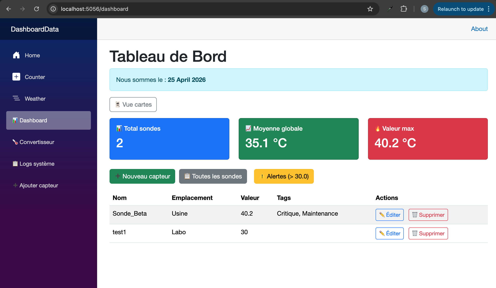
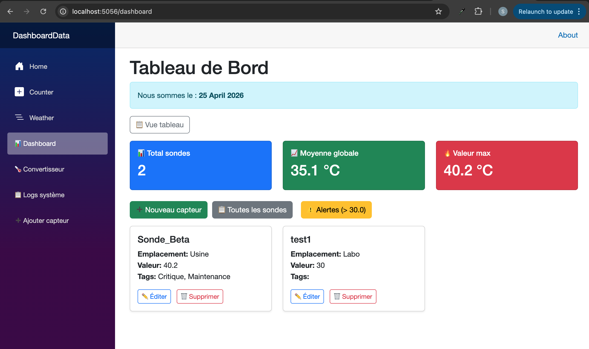

# TP8 – Component Architecture & Communication

**Author:** safabelhouche  
**Branch:** `tp8`  
**Date:** April 2025  


## 🧭 TP8 – Overview

### 🎯 General Objective
Refactor the dashboard into **reusable UI components** to make the code modular, maintainable, and testable.  
Learn how to pass data **from parent to child** using `[Parameter]` and how to send events **from child back to parent** using `EventCallback`.  
Create components for KPIs (`KpiCard`), sensor table (`SensorTable`), and sensor card (`SensorCard`).  
Add a **view toggle** to switch between table and card layouts.

### 🧠 Why component architecture?
- **Reusability** – components can be used in multiple places.
- **Separation of concerns** – each component does one thing.
- **Easier maintenance** – change one component, affect all its uses.
- **Better collaboration** – different developers can work on different components.


## 📋 TP8 Activities 

| Activity | What I did | What I learned |
|----------|------------|----------------|
| **1** | Created `KpiCard.razor` with `[Parameter]` properties | Passing simple data (string, number) to a child component |
| **2** | Replaced the three hardcoded cards in `MyDashboard` with `<KpiCard>` | Composition and reusability |
| **3** | Created `SensorTable.razor` and moved the table HTML | Passing a list of objects via `[Parameter]` |
| **4** | Added `EventCallback<int> OnDeleteClicked` to `SensorTable` | Child‑to‑parent communication (notifying parent of an action) |
| **5** | Created `SensorCard.razor` (Exercise 1) | Displaying a single sensor as a Bootstrap card |
| **6** | Added view toggle (table / cards) with a button (Exercise 2) | Conditional rendering and UI state management |

At the end, `MyDashboard.razor` is clean and composed of reusable components.


## 🗺️ Communication Flow Diagram

### Parent → Child (data)
```
MyDashboard.razor
    <KpiCard Title="Total sondes" Value="@totalCount" ... />
                    ↓
            [Parameter] string Title
            [Parameter] string Value
                    ↓
            KpiCard displays the data
```

### Child → Parent (events)
```
SensorTable.razor
    <button @onclick="() => OnDeleteClicked.InvokeAsync(sensor.Id)">
                    ↓
            EventCallback<int> OnDeleteClicked
                    ↓
            MyDashboard.razor binds OnDeleteClicked="DeleteSensor"
                    ↓
            DeleteSensor(int id) runs in the parent
```


## 🔧 Key Blazor Component Concepts 

| Concept | Purpose | MERN equivalent |
|---------|---------|-----------------|
| `[Parameter]` | Receives data from parent component | `props` in React |
| `EventCallback<T>` | Sends an event (with data) from child to parent | callback function passed as prop |
| `@bind-Value` | Two‑way binding on component parameters | `value` + `onChange` |
| Child component reuse | `<KpiCard ... />` multiple times | `<KpiCard ... />` in JSX |
| `@if` / `@else` | Conditional rendering | ternary or `&&` operator |


## 📁 Project Structure (after TP8)

```
DashboardData/
├── Components/
│   ├── UI/                                 ← new folder for reusable components
│   │   ├── KpiCard.razor                   ← displays a single KPI
│   │   ├── SensorTable.razor               ← displays the sensor table (with delete event)
│   │   └── SensorCard.razor                ← displays a single sensor as a card
│   └── Pages/
│       └── MyDashboard.razor               ← now uses these components
├── Models/
├── Services/
├── Data/
├── wwwroot/
├── tp8-dashboard-table.png                 ← screenshot (table view)
├── tp8-dashboard-cards.png                 ← screenshot (card view)
└── ...
```

---

## 📂 Files in this branch

| File | Description |
|------|-------------|
| `DashboardData/Components/UI/KpiCard.razor` | Reusable KPI card (Title, Value, BackgroundColor, Icon). |
| `DashboardData/Components/UI/SensorTable.razor` | Table component that receives `List<SensorData>` and an `EventCallback` for delete. |
| `DashboardData/Components/UI/SensorCard.razor` | Card component for a single sensor (Exercise 1). |
| `DashboardData/Components/Pages/MyDashboard.razor` | Refactored to use `<KpiCard>`, `<SensorTable>`, and view toggle. |
| `DashboardData/tp8-dashboard-table.png` | Screenshot of the dashboard in table view. |
| `DashboardData/tp8-dashboard-cards.png` | Screenshot of the dashboard in card view. |

---

## ▶️ How to run

```bash
cd DashboardData
dotnet watch
```

Then open `https://localhost:5056/dashboard`.  
Click the **"🃏 Vue cartes"** button to switch to card view; click **"📋 Vue tableau"** to go back.

---

## 📸 Execution output

### Table view (default)


### Card view (after clicking the toggle button)



## 🧠 What I learned

- ✅ How to create **dumb components** that receive data via `[Parameter]`.
- ✅ How to **reuse** the same component multiple times with different data.
- ✅ How to use `EventCallback<T>` to **notify the parent** when an action occurs (e.g., delete button clicked).
- ✅ How to **move logic** (like delete) out of child components – children only emit events, parents handle the actual operation.
- ✅ How to add a **view toggle** to switch between two different visual representations of the same data.
- ✅ How to keep `MyDashboard.razor` clean and focused on orchestrating components.


## 🔗 Branch information

This code is stored in the **`tp8` branch** of the repository.  
It builds on `tp7` (CRUD, validation) and adds component architecture and view toggle.

---

**Copyright © 2025 safabelhouche – All rights reserved.**  
*This work is part of the .NET C# Programming course at Ecole Polytechnique de Sousse.*