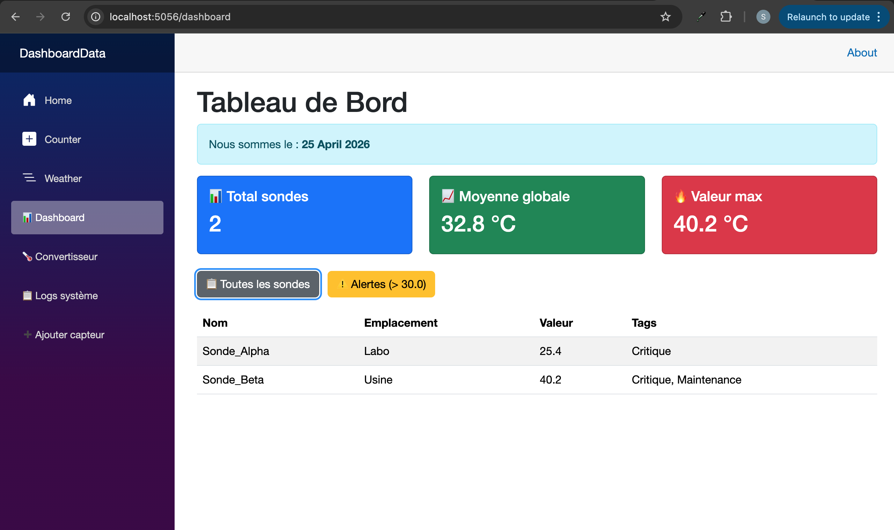
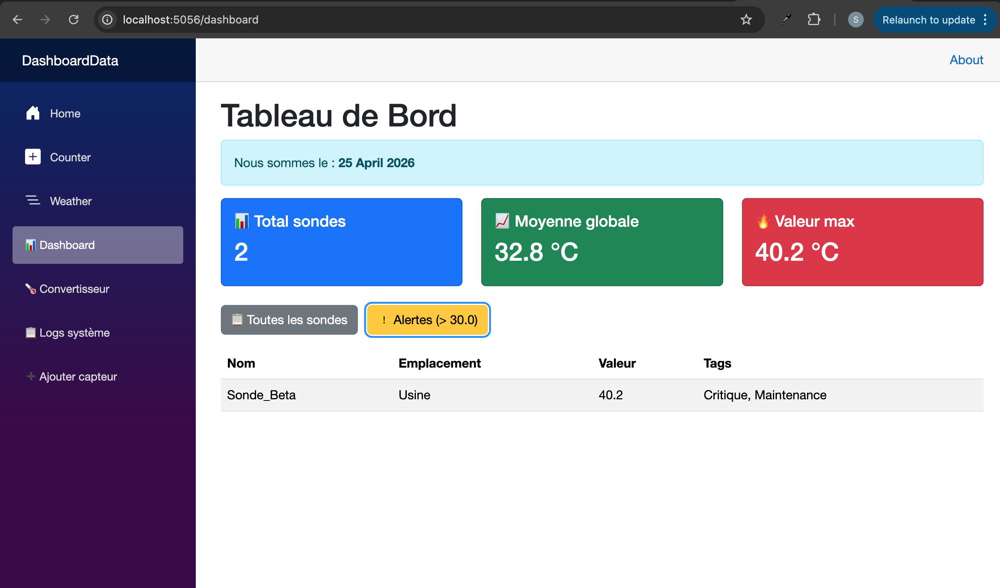

# TP6 – Async LINQ to SQL (KPIs & Filtering)

**Author:** safabelhouche  
**Branch:** `tp6`  
**Date:** April 2025  


## 🧭 TP6 – Overview

### 🎯 General Objective
Make the dashboard **efficient** by moving data processing (filtering, sorting, aggregations) **from the application to the database**.  
Use **async LINQ** methods like `Where`, `OrderByDescending`, `CountAsync`, `AverageAsync`, `MaxAsync` – they are translated to SQL and executed inside SQLite.

### 🧠 Why async LINQ on the database?
- **Performance** – only the needed rows are sent over the network.
- **Scalability** – aggregations (`Count`, `Average`, `Max`) are computed on the DB side.
- **Clean code** – no manual loops; declarative queries.

**MERN comparison:**  
`_context.Sensors.CountAsync()` ≈ `Sensor.countDocuments()`  
`_context.Sensors.Where(s => s.Value > 30).ToListAsync()` ≈ `Sensor.find({ value: { $gt: 30 } })`


## 📋 TP6 Activities 

| Activity | What I did | What I learned |
|----------|------------|----------------|
| **1** | Added `GetTotalCountAsync`, `GetAverageValueAsync`, `GetMaxValueAsync` to service | Aggregation methods that run on the DB |
| **2** | Added `GetCriticalSensorsAsync(threshold)` with `Where` and `OrderByDescending` | Server‑side filtering and sorting |
| **3** | Displayed KPIs in Bootstrap cards | Presenting aggregated data |
| **4** | Added buttons to switch between "All sensors" and "Critical sensors" | Real‑time filtering without page reload |
| **5** | Added loading spinner (`@if (isLoading)`) | Improved user experience |

At the end, the dashboard shows KPIs and can filter sensors by value.


## 🗺️ Flow Diagram – Efficient Queries

```
User clicks "Alertes (>30.0)"
         ↓
MyDashboard.razor calls SensorService.GetCriticalSensorsAsync(30)
         ↓
EF Core translates LINQ to SQL:
   SELECT * FROM Sensors
   WHERE Value > 30
   ORDER BY Value DESC
         ↓
SQLite executes query and returns only filtered rows
         ↓
Dashboard updates without loading all sensors
```

---

## 🔧 Key LINQ Methods Explained 

| Method | Purpose | SQL equivalent | JS equivalent |
|--------|---------|----------------|----------------|
| `.CountAsync()` | Returns number of rows | `SELECT COUNT(*)` | `await collection.countDocuments()` |
| `.AverageAsync(s => s.Value)` | Average of a column | `SELECT AVG(Value)` | manual reduce / aggregate |
| `.MaxAsync(s => s.Value)` | Maximum value | `SELECT MAX(Value)` | `Math.max` + map / aggregate |
| `.Where(s => s.Value > threshold)` | Filter rows | `WHERE Value > @threshold` | `.filter()` |
| `.OrderByDescending(s => s.Value)` | Sort descending | `ORDER BY Value DESC` | `.sort((a,b)=>b-a)` |
| `.Include(s => s.Location)` | Eager load related entity | `LEFT JOIN Locations` | `.populate()` |

All these methods are **executed inside the database** – only the final result is sent to the app.


## 📁 Project Structure (after TP6)

```
DashboardData/
├── Components/
│   └── Pages/
│       └── MyDashboard.razor          ← updated with KPIs and filter buttons
├── Services/
│   ├── ISensorService.cs              ← new async methods
│   └── SensorService.cs               ← implementations with EF Core
├── Models/                            ← unchanged from TP5
├── Data/                              ← unchanged
├── app.db                             ← SQLite database
├── tp6-dashboard-full.png             ← screenshot (all sensors)
├── tp6-dashboard-critical.png         ← screenshot (critical only)
└── ...
```


## 📂 Files in this branch

| File | Description |
|------|-------------|
| `DashboardData/Services/ISensorService.cs` | Added `GetTotalCountAsync`, `GetAverageValueAsync`, `GetMaxValueAsync`, `GetCriticalSensorsAsync`. |
| `DashboardData/Services/SensorService.cs` | Implementations using `CountAsync`, `AverageAsync`, `MaxAsync`, `Where`, `OrderByDescending`. |
| `DashboardData/Components/Pages/MyDashboard.razor` | KPIs cards, filter buttons, loading spinner. |
| `DashboardData/tp6-dashboard-full.png` | Screenshot showing all sensors with KPIs. |
| `DashboardData/tp6-dashboard-critical.png` | Screenshot showing only sensors with value > 30. |


## ▶️ How to run

```bash
cd DashboardData
dotnet watch
```

Then open `https://localhost:5056/dashboard`.  
Click the **Alertes (>30.0)** button to see only critical sensors.  
Click **Toutes les sondes** to restore the full list.


## 📸 Execution output

### All sensors (default)


### Critical sensors (value > 30)



## 🧠 What I learned

- ✅ **Server‑side filtering** – `Where` clause is translated to SQL `WHERE`, reducing network traffic.
- ✅ **Async aggregations** – `CountAsync`, `AverageAsync`, `MaxAsync` run on the DB, not in memory.
- ✅ **Eager loading** – `Include()` loads related entities in one query (JOIN).
- ✅ **Dynamic UI** – buttons switch between different queries without reloading the page.
- ✅ **Loading spinner** – improves perceived performance during async operations.


## 🔗 Branch information

This code is stored in the **`tp6` branch** of the repository.  
It builds on `tp5` (database, seeding, relationships) and adds efficient LINQ queries and a more interactive dashboard.

---

**Copyright © 2025 safabelhouche – All rights reserved.**  
*This work is part of the .NET C# Programming course at Ecole Polytechnique de Sousse.*