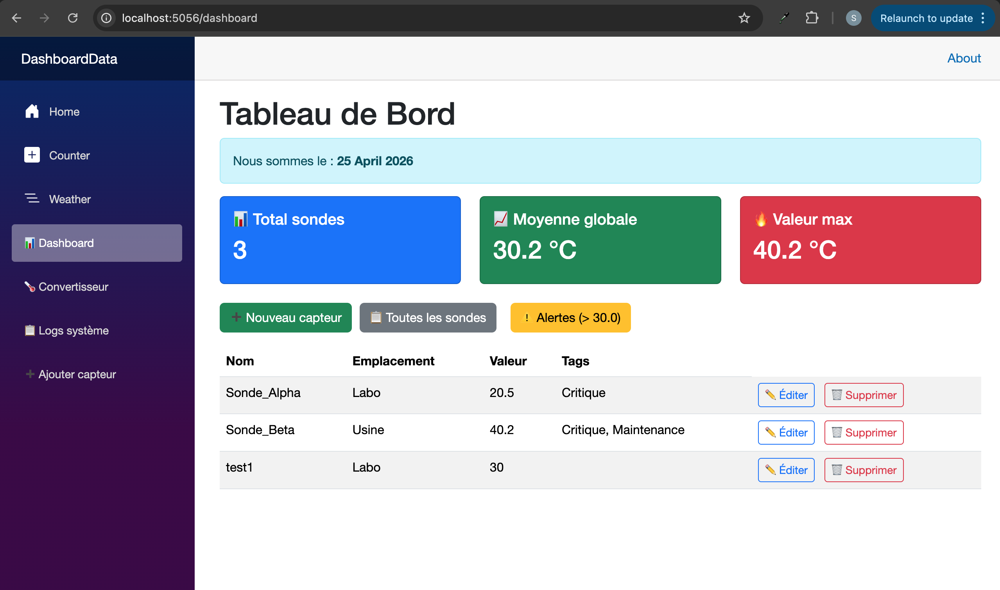
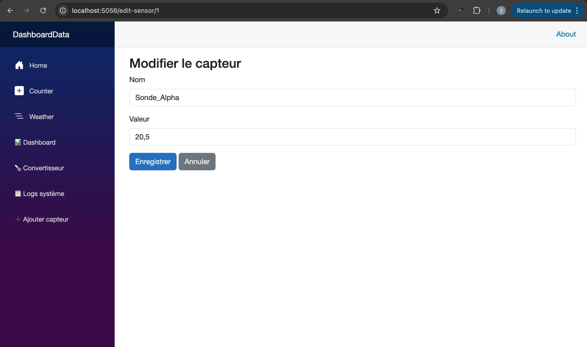
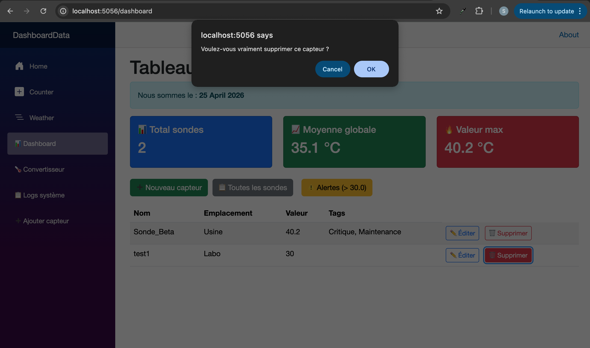

# TP7 – CRUD Forms & Validation (Unified Add/Edit)

**Author:** safabelhouche  
**Branch:** `tp7`  
**Date:** April 2025  


## 🧭 TP7 – Overview

### 🎯 General Objective
Add **full CRUD** (Create, Read, Update, Delete) to the sensor dashboard using Blazor's built‑in forms and validation.  
Create a **unified form** (`EditSensor.razor`) that handles both adding and editing sensors via an optional `Id` route parameter.  
Use **Data Annotations** to automatically validate user input (`[Required]`, `[StringLength]`, `[Range]`).  
Add **Edit** and **Delete** buttons to the dashboard table, with a **confirmation dialog** for deletion (bonus exercise).

### 🧠 Why this matters
- **CRUD** is the foundation of most line‑of‑business applications.
- **Unified form** avoids code duplication (same form for add and edit).
- **DataAnnotations validation** gives you client‑side (and server‑side) validation without writing JavaScript.
- The **delete confirmation** prevents accidental data loss.


## 📋 TP7 Activities 

| Activity | What I did | What I learned |
|----------|------------|----------------|
| **1** | Extended `ISensorService` with `GetSensorByIdAsync`, `UpdateSensorAsync`, `DeleteSensorAsync` | Full CRUD on service layer |
| **2** | Created `EditSensor.razor` with two routes (`/edit-sensor`, `/edit-sensor/{Id:int}`) | Unified add/edit pattern |
| **3** | Used `EditForm`, `DataAnnotationsValidator`, `InputText`, `InputNumber`, `InputSelect` | Blazor form handling and validation |
| **4** | Added validation attributes to `SensorData` model | `[Required]`, `[StringLength]`, `[Range]`, `[Range]` for LocationId |
| **5** | Updated `MyDashboard.razor` with **Edit** and **Delete** buttons | Integrating CRUD in the UI |
| **6** | Added delete confirmation using `IJSRuntime` (bonus) | Calling JavaScript `confirm` from C# |
| **7** | Added Location dropdown to the form | Avoiding foreign key errors |

At the end, the dashboard has a complete CRUD interface with validation and confirmation.


## 🗺️ Flow Diagram – Add / Edit Sensor

### Add mode (no ID in URL)
```
User clicks "➕ Nouveau capteur" → navigates to /edit-sensor
         ↓
EditSensor.razor loads → currentSensor = new SensorData()
         ↓
User fills Name, Value, chooses Location → clicks Enregistrer
         ↓
OnValidSubmit triggers HandleValidSubmit (validation passes)
         ↓
AddSensorAsync called (because Id is null) → sensor saved to database
         ↓
Redirect to /dashboard → dashboard shows updated list + refreshed KPIs
```

### Edit mode (ID in URL, e.g., /edit-sensor/5)
```
User clicks "✏️ Éditer" next to a sensor → navigates to /edit-sensor/{Id}
         ↓
EditSensor.razor loads → fetches existing sensor by Id via GetSensorByIdAsync
         ↓
Form pre‑filled with existing Name, Value, Location
         ↓
User modifies data → clicks Enregistrer
         ↓
OnValidSubmit triggers HandleValidSubmit (validation passes)
         ↓
UpdateSensorAsync called → changes saved to database
         ↓
Redirect to /dashboard → dashboard shows updated list + refreshed KPIs
```


## 🔧 Key Blazor Form Concepts

| Component | Purpose | Equivalent in React |
|-----------|---------|---------------------|
| `EditForm` | Wraps form, handles validation and submission | `<form onSubmit={...}>` |
| `DataAnnotationsValidator` | Reads validation attributes from model | `yup` / `zod` integration |
| `ValidationSummary` | Displays all validation errors | `errors.summary` |
| `ValidationMessage` | Displays error for a specific field | `errors.name?.message` |
| `InputText` | Text input with validation integration | `<input>` + `value` + `onChange` |
| `InputNumber` | Numeric input with validation | `<input type="number">` |
| `InputSelect` | Dropdown with validation | `<select>` + `value` + `onChange` |


## 📁 Project Structure (after TP7)

```
DashboardData/
├── Components/
│   └── Pages/
│       ├── MyDashboard.razor          ← added Edit/Delete buttons
│       └── EditSensor.razor           ← unified add/edit form
├── Models/
│   └── SensorData.cs                  ← added validation attributes
├── Services/
│   ├── ISensorService.cs              ← CRUD methods
│   └── SensorService.cs               ← implementations
├── Data/                              ← (unchanged)
├── app.db                             ← SQLite database
├── tp7-edit-form.png                  ← screenshot of edit form
├── tp7-dashboard.png                  ← screenshot of dashboard with buttons
└── ...
```


## 📂 Files in this branch

| File | Description |
|------|-------------|
| `DashboardData/Components/Pages/EditSensor.razor` | Unified form for add and edit, with validation and Location dropdown. |
| `DashboardData/Components/Pages/MyDashboard.razor` | Added "Nouveau capteur" button, Edit and Delete buttons, delete confirmation. |
| `DashboardData/Models/SensorData.cs` | Validation attributes: `[Required]`, `[StringLength]`, `[Range]`. |
| `DashboardData/Services/ISensorService.cs` | Added `GetSensorByIdAsync`, `UpdateSensorAsync`, `DeleteSensorAsync`, `GetLocationsAsync`. |
| `DashboardData/Services/SensorService.cs` | Implementations using EF Core. |
| `DashboardData/tp7-edit-form.png` | Screenshot of the form with dropdown and validation error (if any). |
| `DashboardData/tp7-dashboard.png` | Screenshot of the dashboard with Edit/Delete buttons. |


## ▶️ How to run

```bash
cd DashboardData
dotnet watch
```

Then open:
- Dashboard: `https://localhost:5000/dashboard`
- Add a new sensor: click **➕ Nouveau capteur** (or navigate to `/edit-sensor`)
- Edit an existing sensor: click **✏️ Éditer** next to a sensor
- Delete a sensor: click **🗑️ Supprimer** → confirmation dialog appears


## 📸 Execution output

### Dashboard with Edit and Delete buttons


### Edit / Add Sensor Form (with Location dropdown)



### Confirm delete dialog (IJSRuntime)



## 🧠 What I learned

- ✅ How to create a **unified add/edit page** using an optional route parameter.
- ✅ How to use `EditForm`, `DataAnnotationsValidator`, and `ValidationMessage` for automatic validation.
- ✅ How to add **validation attributes** to a model (`[Required]`, `[StringLength]`, `[Range]`).
- ✅ How to **load dropdown data** (Locations) asynchronously in a form.
- ✅ How to add **Edit** and **Delete** buttons to a table.
- ✅ How to **call JavaScript** from Blazor (`IJSRuntime.InvokeAsync<bool>("confirm", ...)`) for a confirmation dialog.
- ✅ How to **refresh the table and KPIs** after a delete operation.


## 🔗 Branch information

This code is stored in the **`tp7` branch** of the repository.  
It builds on the work from `tp6` (KPIs, async LINQ) and adds full CRUD with validation.

---

**Copyright © 2025 safabelhouche – All rights reserved.**  
*This work is part of the .NET C# Programming course at Ecole Polytechnique de Sousse.*