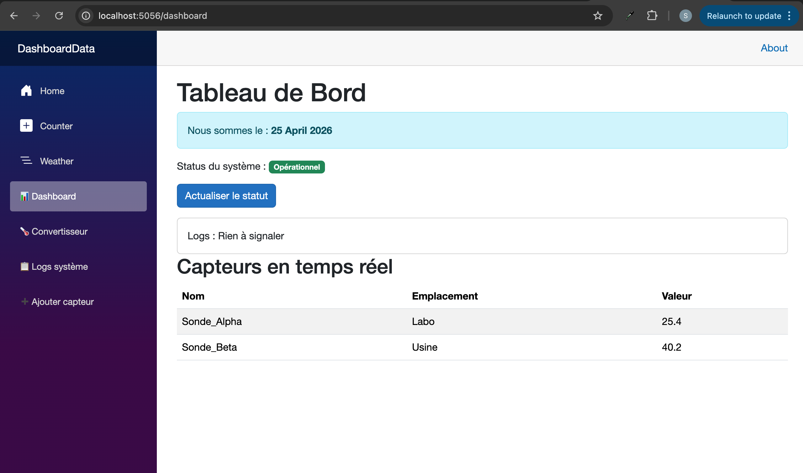
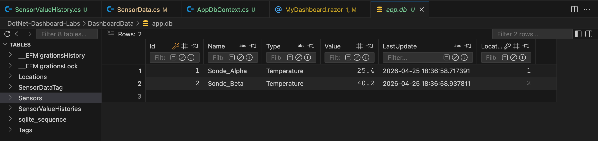

# TP5 – Entity Framework Core & SQLite (Database Persistence)

**Author:** safabelhouche  
**Branch:** `tp5`  
**Date:** April 2025  


## 🧭 TP5 – Overview

### 🎯 General Objective
Replace the **in‑memory list** in `SensorService` with a **real SQLite database** using Entity Framework Core (EF Core).  
Learn **Code‑First** development: define C# classes, and EF Core creates the database schema.  
Understand **relationships** (1‑to‑N, N‑to‑N) and **migrations**.

### 🧠 Why EF Core?
- **ORM** – maps C# objects to database tables.
- **LINQ to SQL** – queries written in LINQ are translated to SQL and executed on the DB.
- **Migrations** – version control for your database schema.
- **Relationships** – easy handling of foreign keys and pivot tables.


## 📋 TP5 Activities 

| Activity | What I did | What I learned |
|----------|------------|----------------|
| **1** | Installed EF Core packages (`Sqlite`, `Design`, `dotnet-ef` tool) | Tooling for migrations |
| **2** | Added `Location` and `Tag` models, modified `SensorData` | Relationships: 1‑to‑N, N‑to‑N |
| **3** | Created `AppDbContext` with `DbSet<>` properties | The bridge between C# and database |
| **4** | Configured connection string in `appsettings.json` and registered DbContext in `Program.cs` | DI for DbContext |
| **5** | Ran migrations (`InitialCreate`) and updated database | Generated SQLite file `app.db` |
| **6** | Seeded the database with Locations, Tags, Sensors with relations – **Exercice 1** | Data seeding |
| **7** | Added `SensorValueHistory` model and migration – **Exercice 2** | Adding a new 1‑to‑N relationship |

At the end, the dashboard reads and writes data from/to a real SQLite database.


## 🗺️ Flow Diagram – Before vs After TP5

### Before (TP4 – in‑memory list)
```
SensorService (private List<SensorData> _sensors)
         ↓
MyDashboard.razor displays data from memory
         ↓
Data lost on app restart
```

### After (TP5 – SQLite database)
```
AppDbContext (connected to app.db)
         ↓
SensorService (uses DbContext to query database)
         ↓
MyDashboard.razor displays data from real DB
         ↓
Data persists across restarts
```


## 🔧 New Concepts

- **`[Key]`** – marks a property as the Primary Key.
- **`[Required]`** – database column cannot be `NULL`.
- **`[StringLength(100)]`** – maximum length of a string column.
- **`ICollection<T>`** – navigation property for relationships (e.g., one Location has many Sensors).
- **`Include()`** – eager loading: loads related data in a single query (SQL JOIN).
- **Migrations** – `dotnet ef migrations add Name` creates C# files describing schema changes; `dotnet ef database update` applies them.
- **Seeding** – inserting initial data when the database is first created.


## 📁 Project Structure (after TP5)

```
DashboardData/
├── Components/
│   ├── Layout/
│   └── Pages/
├── Data/
│   └── AppDbContext.cs
├── Models/
│   ├── SensorData.cs
│   ├── Location.cs
│   ├── Tag.cs
│   └── SensorValueHistory.cs          ← Exercice 2
├── Services/
│   ├── ISensorService.cs
│   └── SensorService.cs               ← now uses DbContext
├── Migrations/                        ← auto‑generated
├── appsettings.json                   ← connection string added
├── Program.cs                         ← DbContext registration
├── app.db                             ← SQLite database file
└── ...
```


## 📂 Files in this branch

| File | Description |
|------|-------------|
| `DashboardData/Models/Location.cs` | Location entity (1‑to‑N with SensorData). |
| `DashboardData/Models/Tag.cs` | Tag entity (N‑to‑N with SensorData). |
| `DashboardData/Models/SensorData.cs` | Updated with `LocationId`, `Location`, `Tags`. |
| `DashboardData/Models/SensorValueHistory.cs` | History table (Exercice 2). |
| `DashboardData/Data/AppDbContext.cs` | DbContext with DbSets. |
| `DashboardData/Services/SensorService.cs` | Now uses `AppDbContext` and `Include`. |
| `DashboardData/Program.cs` | DbContext registration and seeding code. |
| `DashboardData/app.db` | SQLite database file. |
| `DashboardData/tp5-dashboard-seeded.png` | Screenshot of dashboard showing Location column. |
| `DashboardData/tp5-sqlite-viewer.png` | Screenshot of SQLite Viewer showing tables. |


## ▶️ How to run

```bash
cd DashboardData
dotnet watch
```

Then open `https://localhost:5056/dashboard`. The dashboard will display the seeded sensors with their locations.


## 📸 Execution output

### Dashboard with Location column


### SQLite Viewer showing tables (including SensorValueHistory)



## 🧠 What I learned

- ✅ How to install EF Core packages and use migrations.
- ✅ How to define **1‑to‑N** relationships (foreign key + navigation property).
- ✅ How to define **N‑to‑N** relationships (two `ICollection` navigation properties → EF Core creates pivot table).
- ✅ How to **seed** data with relationships (two `SaveChanges` calls to get generated Ids).
- ✅ How to add a new table (`SensorValueHistory`) and migrate without losing existing data.
- ✅ How to use `Include()` to load related data in a single query.


## 🔗 Branch information

This code is stored in the **`tp5` branch** of the repository.  
It builds on the work from `tp4` (services, DI, async) and adds a real SQLite database.

---

**Copyright © 2025 safabelhouche – All rights reserved.**  
*This work is part of the .NET C# Programming course at Ecole Polytechnique de Sousse.*
