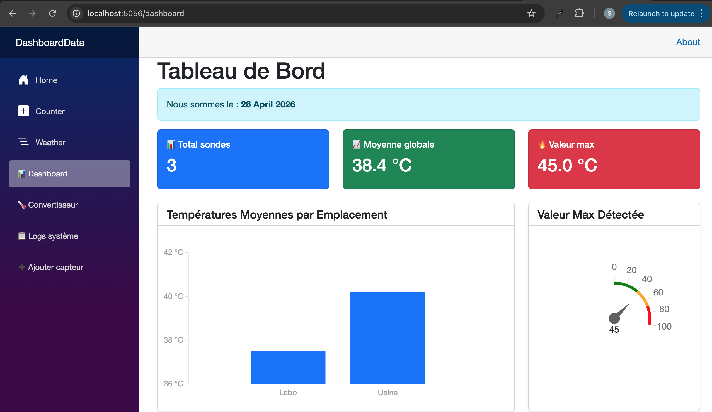
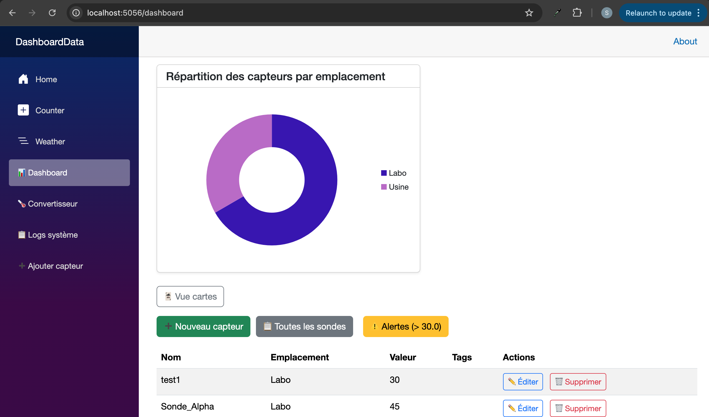

# TP9 – Data Visualization with Radzen (Charts, Gauge, Cross‑Filtering)

**Author:** safabelhouche  
**Branch:** `tp9`  
**Date:** April 2025  

---

## 🧭 TP9 – Overview

### 🎯 General Objective
Add interactive data visualizations to the dashboard using **Radzen.Blazor** components.  
Learn to prepare **aggregated data** with LINQ `GroupBy` (executed on the database).  
Implement a **bar chart** (average value per location), a **radial gauge** (max value), and a **donut chart** (sensor count per location).  
Enable **cross‑filtering**: clicking a bar filters the sensor table/cards below.

### 🧠 Why Radzen?
- Professional charts and gauges without manual JavaScript.
- Tight integration with Blazor and EF Core.
- High performance because aggregation is done in SQL.


## 📋 TP9 Activities 

| Activity | What I did | What I learned |
|----------|------------|----------------|
| **1** | Installed `Radzen.Blazor` and configured theme, services, script | Using third‑party UI libraries |
| **2** | Added `LocationStat` and `LocationCountStat` classes inside `SensorData.cs` | Simple DTOs for chart data |
| **3** | Created `GetAverageValueByLocationAsync()` and `GetSensorCountByLocationAsync()` | LINQ `GroupBy` translated to SQL `GROUP BY` |
| **4** | Added bar chart (`RadzenColumnSeries`) with custom formatter | Data binding and axis formatting |
| **5** | Implemented cross‑filtering (`SeriesClick` event, `FilteredSensors` property) | Interactive dashboards |
| **6** | Added radial gauge for max value | Displaying a single metric with colour zones |
| **7** | Added donut chart for sensor count per location | Another aggregation and chart type |

At the end, the dashboard has professional charts that react to user clicks.


## 🗺️ Data Flow for Bar Chart

```
Database (Sensors table with Location)
         ↓
EF Core + LINQ GroupBy → SQL GROUP BY Location, AVG(Value)
         ↓
SensorService.GetAverageValueByLocationAsync()
         ↓
List<LocationStat> (LocationName, AverageValue)
         ↓
RadzenColumnSeries binds to Data, CategoryProperty, ValueProperty
         ↓
Bar chart rendered
```


## 🔧 Key Radzen Components Used

| Component | Purpose |
|-----------|---------|
| `RadzenChart` | Container for charts |
| `RadzenColumnSeries` | Bar chart series |
| `RadzenValueAxis` | Y‑axis with custom formatter |
| `RadzenRadialGauge` | Gauge with scale and pointer |
| `RadzenRadialGaugeScaleRange` | Colour zones (green, orange, red) |
| `RadzenDonutSeries` | Donut / pie chart |


## 📁 Project Structure (after TP9)

```
DashboardData/
├── Components/
│   ├── UI/               (KpiCard, SensorTable, SensorCard)
│   └── Pages/
│       └── MyDashboard.razor   ← added charts, cross‑filtering, view toggle
├── Models/
│   └── SensorData.cs            ← contains LocationStat and LocationCountStat
├── Services/
│   ├── ISensorService.cs        ← new aggregation methods
│   └── SensorService.cs         ← implementations with GroupBy
├── Data/
├── wwwroot/
├── tp9-dashboard-radzen-charts-1.png       ← screenshot of the dashboard with all charts
├── tp9-dashboard-radzen-charts-2.png 
└── ...
```


## 📂 Files in this branch

| File | Description |
|------|-------------|
| `DashboardData/Models/SensorData.cs` | Added `LocationStat` and `LocationCountStat` inner classes. |
| `DashboardData/Services/ISensorService.cs` | Added `GetAverageValueByLocationAsync`, `GetSensorCountByLocationAsync`. |
| `DashboardData/Services/SensorService.cs` | Implementations using `GroupBy`, `Average`, `Count`. |
| `DashboardData/Components/Pages/MyDashboard.razor` | Integrated all charts, cross‑filtering, view toggle, KPI cards. |
| `DashboardData/Components/_Imports.razor` | Added `@using Radzen` and `@using Radzen.Blazor`. |
| `DashboardData/Program.cs` | Added `builder.Services.AddRadzenComponents()`. |
| `DashboardData/Components/App.razor` | Added `<RadzenTheme Theme="material" />` and the Radzen script. |
| `DashboardData/tp9-dashboard-full.png` | Screenshot showing the bar chart, gauge, donut, and sensor list. |


## ▶️ How to run

```bash
cd DashboardData
dotnet watch
```

Then open `https://localhost:5056/dashboard`.


## 📸 Execution output

### Full dashboard with charts and cross‑filtering




## 🧠 What I learned

- ✅ How to install and configure **Radzen.Blazor**.
- ✅ How to write **aggregation queries** with `GroupBy`, `Average`, and `Count` that run on the database.
- ✅ How to **bind chart data** to a simple list of objects.
- ✅ How to implement **cross‑filtering** using a chart's `SeriesClick` event and a computed property (`FilteredSensors`).
- ✅ How to use a **radial gauge** to show a single critical metric with colour‑coded ranges.
- ✅ How to create a **donut chart** for proportional distribution.
- ✅ How to keep the **view toggle** (table / cards) from TP8 and make it work with the filtered data.


## 🔗 Branch information

This code is stored in the **`tp9` branch** of the repository.  
It builds on `tp8` (component architecture, view toggle) and adds full data visualization.


**Copyright © 2025 safabelhouche – All rights reserved.**  
*This work is part of the .NET C# Programming course at Ecole Polytechnique de Sousse.*