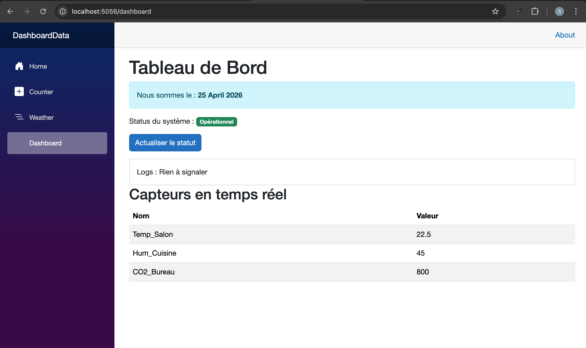
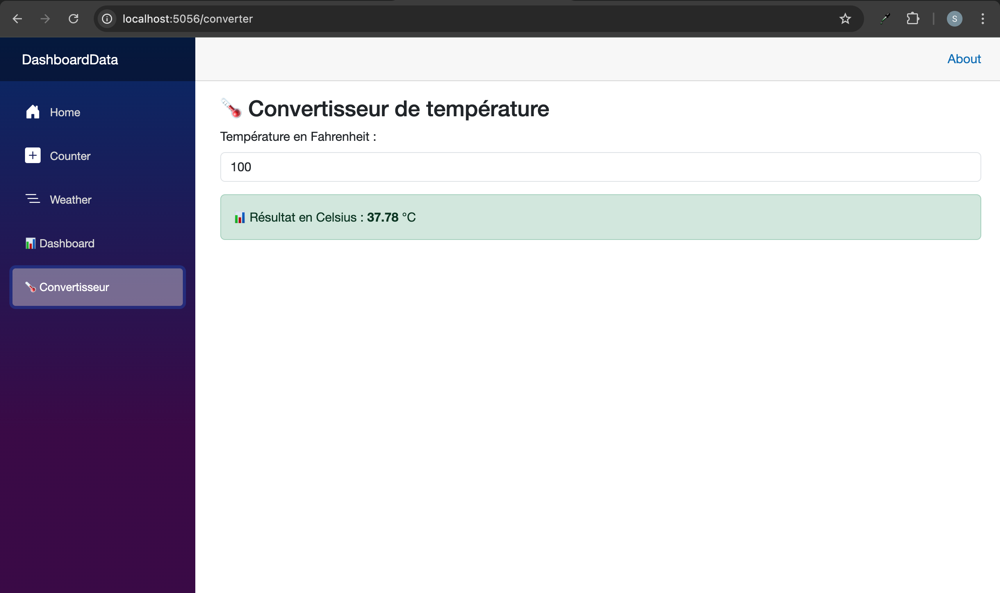
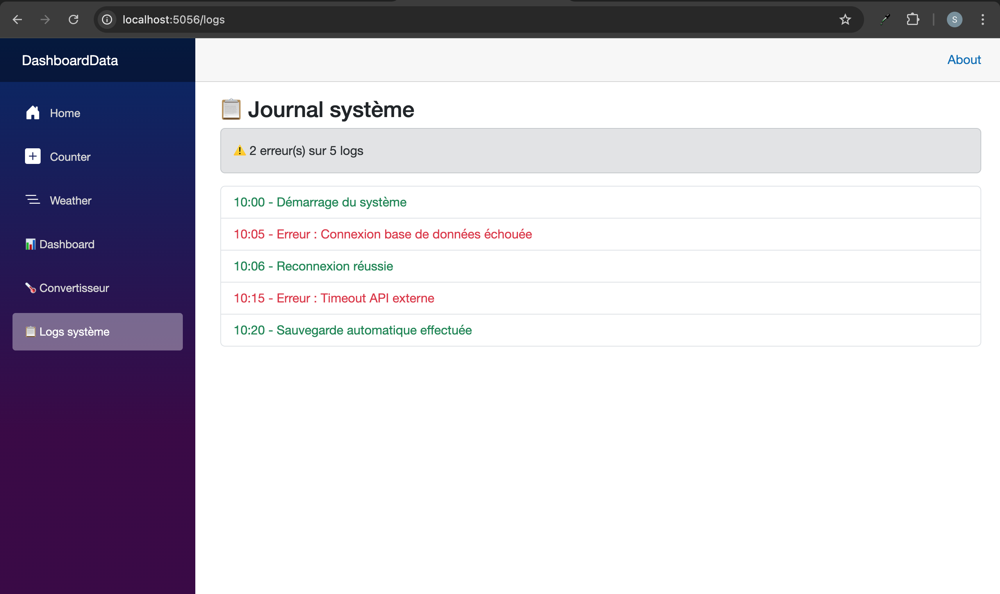

# TP3 – Blazor Web App (Interactive Dashboard)

**Author:** safabelhouche  
**Branch:** `tp3`  
**Date:** April 2025  


## 🧭 TP3 – Blazor Web App (Overview)

### 🎯 General Objective
Move from the **console** (black screen) to a **real web application** with a graphical interface, using Blazor – Microsoft's framework for interactive web UIs with C# instead of JavaScript.

### 🧠 Why Blazor?
I already know C# from TP1‑2. Blazor will let me use that same language to build **modern, interactive web pages** without writing a single line of JavaScript. It runs on the server via WebSockets (SignalR) or on WebAssembly.

### 🧩 Core Concepts (MERN comparison)

| Blazor concept | React equivalent |
|----------------|------------------|
| `.razor` component | `.jsx` component |
| `@page "/url"` | `<Route path="/url" element={<Page />}` |
| `@rendermode InteractiveServer` | enables client‑server interaction (like a live connection) |
| `@code { ... }` | `export default function Component() { ... }` |
| `@onclick="Method"` | `onClick={handler}` |
| `@DateTime.Now` | `{new Date().toLocaleDateString()}` |
| `@if (condition) { ... }` | `{condition ? <div>...</div> : null}` |
| `NavLink` | `NavLink` from React Router |


## 📋 TP3 Activities

| Activity | What i did | What i learned |
|----------|------------------|----------------|
| **1** | Generate and explore the Blazor project | Project structure, files, `dotnet watch` (hot reload) |
| **2** | Create `MyDashboard.razor` page | Routing, HTML/C# mixing, conditional rendering |
| **3** | Add a link to the left menu | Navigation, `NavLink` component |
| **4** | Make the page interactive (`@onclick`) | Event handling, state change → UI update |
| **5** | Integrate a data class (`SensorData`) | Using models, display a list in a table |
| **Exercice 1** | Temperature converter (two‑way binding) | `@bind`, `InputNumber`, computed values |
| **Exercice 2** | System log simulator (dynamic CSS) | `@foreach`, conditional CSS classes |


## 🗺️ Flow Diagram (Main Dashboard)

```
User opens browser → /dashboard
         ↓
Blazor loads MyDashboard.razor
         ↓
Page shows: date, status badge, a button
         ↓
User clicks button → RefreshSystem() C# method runs
         ↓
IsSystemOK and LastLog change → UI updates automatically
         ↓
No page reload, no JavaScript – just C# events
```


## 📁 Project Structure

```
DashboardData/
├── Components/
│   ├── Layout/
│   │   ├── MainLayout.razor
│   │   └── NavMenu.razor
│   └── Pages/
│       ├── Home.razor
│       ├── Counter.razor
│       ├── Weather.razor
│       ├── MyDashboard.razor      (main dashboard)
│       ├── Converter.razor        (Exercise 1)
│       └── Logs.razor             (Exercise 2)
├── Models/
│   └── SensorData.cs
├── Program.cs
├── appsettings.json
└── wwwroot/
```


## 📂 Files in this branch

| File | Description |
|------|-------------|
| `DashboardData/` | Complete Blazor Web App project. |
| `DashboardData/Components/Pages/MyDashboard.razor` | Main dashboard page (status button + sensor table). |
| `DashboardData/Components/Pages/Converter.razor` | Temperature converter (two‑way binding). |
| `DashboardData/Components/Pages/Logs.razor` | System log simulator (dynamic CSS classes). |
| `DashboardData/Models/SensorData.cs` | Sensor model. |
| `DashboardData/tp3-dashboard.png` | Screenshot of the main dashboard. |
| `DashboardData/tp3-converter.png` | Screenshot of the converter page. |
| `DashboardData/tp3-logs.png` | Screenshot of the logs page. |


## ▶️ How to run

```bash
cd DashboardData
dotnet watch
```

Then open in browser:
- Main dashboard: `https://localhost:{PORT}/dashboard`
- Converter: `https://localhost:{PORT}/converter`
- Logs: `https://localhost:{PORT}/logs`


## 📸 Execution output

### Main Dashboard


### Temperature Converter


### System Log Simulator



## 🧠 What I learned

- ✅ Blazor components combine HTML and C# in `.razor` files.
- ✅ `@page` defines a route, `@rendermode InteractiveServer` enables live interaction.
- ✅ `@onclick` calls C# methods without JavaScript.
- ✅ State changes automatically update the UI.
- ✅ `@foreach` and `@if` allow dynamic HTML generation.
- ✅ `NavLink` provides active link highlighting.
- ✅ **Two‑way binding** with `@bind` connects an input to a C# field.
- ✅ **Ternary operator** in `class` attribute enables dynamic CSS styling.
- ✅ **Computed properties** (`int ErrorCount => ...`) recalculate when the UI re‑renders.


## 🔗 Branch information

This code is stored in the **`tp3` branch** of the repository.

---

**Copyright © 2025 safabelhouche – All rights reserved.**  
*This work is part of the .NET C# Programming course at Ecole Polytechnique de Sousse.*
