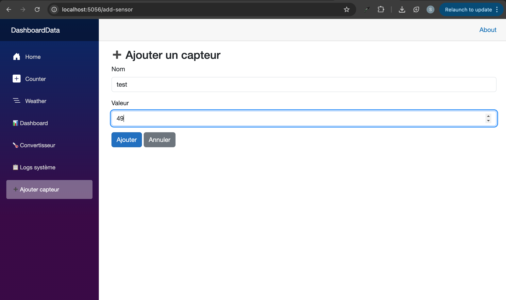
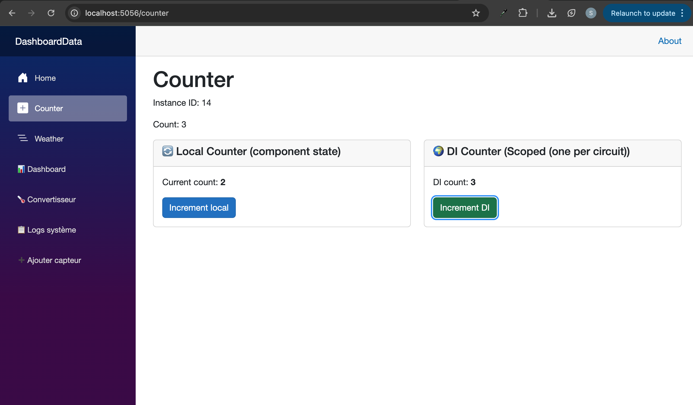

# TP4 – Dependency Injection & Asynchronous Services

**Author:** safabelhouche  
**Branch:** `tp4`  
**Date:** April 2025  


## 🧭 TP4 – Dependency Injection (Overview)

### 🎯 General Objective
Separate the **data logic** from the **UI** by moving the sensor list into a dedicated **service**.  
Learn how to **register** and **inject** services using the built‑in Dependency Injection (DI) container.  
Make the service **asynchronous** to simulate real‑world delays and add a **loading indicator** to the dashboard.  
Implement a **page to add new sensors** (Exercice 1) and **experiment with DI lifetimes** (Bonus).

### 🧠 Why Dependency Injection?
- **Separation of concerns** – UI (Blazor) and business logic (services) are independent.
- **Reusability** – the same service can be used in many pages.
- **Testability** – you can replace the real service with a mock for unit tests.
- **Flexibility** – swap implementations (e.g., from in‑memory list to a real database) without changing the page.


## 🔁 Core Concepts (MERN comparison)

| DI concept | React / Node equivalent |
|------------|-------------------------|
| Service class | A JavaScript module that fetches data (e.g., `sensorService.js`) |
| Interface (`ISensorService`) | TypeScript interface / contract |
| `AddScoped` | Registering a provider with a specific lifetime (per user circuit) |
| `@inject` | `import` + using a hook / context (e.g., `useContext`) |


## 📋 TP4 Activities

| Activity | What I did | What I learned |
|----------|------------|----------------|
| **1** | Created `SensorService` with an in‑memory list | Writing a plain C# data service |
| **2** | Defined `ISensorService` interface | Interface = contract; allows multiple implementations |
| **3** | Registered the service in `Program.cs` with `AddScoped` | DI container configuration |
| **4** | Injected `ISensorService` into `MyDashboard.razor` using `@inject` | Using a service inside a component |
| **5** | Made the service asynchronous (`GetSensorsAsync`) with `Task.Delay(2000)` | Simulate network latency |
| **6** | Updated the dashboard to use `OnInitializedAsync` and added a loading spinner | Async UI patterns |
| **Exercice 1** | Created `AddSensor.razor` to add new sensors | Using the service to write data; navigation after save |
| **Bonus** | Created `UserCounterService` and experimented with Singleton, Scoped, Transient | Understanding DI lifetimes |


## 🗺️ Flow Diagram (Without vs With DI)

### Before (TP3)
```
MyDashboard.razor
   └── hardcoded list of sensors (inside @code)
```

### After (TP4)
```
Program.cs (registers service)
       ↓
MyDashboard.razor → @inject ISensorService
       ↓
SensorService (provides data)
       ↓
MyDashboard.razor displays the data + loading spinner
```


## 📁 Project Structure (after TP4)

```
DashboardData/
├── Components/
│   ├── Layout/
│   │   ├── MainLayout.razor
│   │   └── NavMenu.razor
│   └── Pages/
│       ├── MyDashboard.razor      ← modified to use service + async
│       ├── AddSensor.razor        ← Exercice 1
│       ├── Counter.razor          ← modified for Bonus experiment
│       ├── Converter.razor
│       └── Logs.razor
├── Models/
│   └── SensorData.cs
├── Services/
│   ├── ISensorService.cs
│   ├── SensorService.cs
│   └── UserCounterService.cs      ← Bonus experiment
├── Program.cs                      ← registration added
├── appsettings.json
└── wwwroot/
```


## 📂 Files in this branch

| File | Description |
|------|-------------|
| `DashboardData/Services/ISensorService.cs` | Interface with `GetSensorsAsync()` and `AddSensor()`. |
| `DashboardData/Services/SensorService.cs` | Service with in‑memory list, `Task.Delay`, and `AddSensor()`. |
| `DashboardData/Services/UserCounterService.cs` | Simple counter service for DI lifetimes experiment. |
| `DashboardData/Components/Pages/MyDashboard.razor` | Injected service, async loading, loading spinner. |
| `DashboardData/Components/Pages/AddSensor.razor` | Page to add a new sensor (Exercice 1). |
| `DashboardData/Components/Pages/Counter.razor` | Modified to demonstrate DI lifetimes (Bonus). |
| `DashboardData/Program.cs` | Service registrations (`AddScoped<ISensorService, SensorService>()`, and one lifetime for `UserCounterService`). |
| `DashboardData/tp4-add-sensor.png` | Screenshot of the "Ajouter un capteur" page. |
| `DashboardData/tp4-bonus-counter.png` | Screenshot of the Counter page showing DI counter and instance ID. |
| *(other files from TP3)* | Converter, Logs, models, etc. |


## ▶️ How to run

```bash
cd DashboardData
dotnet watch
```

Then open in your browser:
- Main dashboard (with loading spinner): `https://localhost:5056/dashboard`
- Add sensor page: `https://localhost:5056/add-sensor`
- Counter page (DI lifetime experiment): `https://localhost:5056/counter`


## 📸 Execution output

### Exercice 1 – Add Sensor page


### Bonus – DI lifetimes experiment (Counter page)


---

## 🧪 Bonus – DI Lifetimes Experiment (explanation)

In `Counter.razor`, I injected `UserCounterService` twice (or once, depending on the test) and displayed:
- Instance ID (to see if it's the same or different)
- Current count
- Buttons to increment

By changing the registration in `Program.cs` between `AddSingleton`, `AddScoped`, and `AddTransient`, I observed:

| Lifetime | Behavior |
|----------|----------|
| `Singleton` | One instance shared across all browser tabs. Increment in Tab A → refresh Tab B shows the updated count. |
| `Scoped` | Each tab gets its own instance. Increments are isolated. |
| `Transient` | Even within the same page, each injection gets a new instance. |

**Conclusion:** DI lifetimes control how long and where a service instance lives. Choosing the right lifetime is important for performance and correctness.


## 🧠 What I learned

- ✅ How to create a **service** (plain C# class) and an **interface**.
- ✅ How to **register** the service in `Program.cs` (`AddScoped`, `AddSingleton`, `AddTransient`).
- ✅ How to **inject** the service into a component using `@inject`.
- ✅ The difference between **synchronous** and **asynchronous** service methods.
- ✅ How to simulate a delay with `Task.Delay`.
- ✅ How to use `OnInitializedAsync` and add a **loading spinner** (`@if (isLoading)`).
- ✅ How to build a **form** that sends data to the service (`AddSensor` page).
- ✅ How to **navigate** programmatically with `NavigationManager`.
- ✅ The meaning and effect of **Singleton, Scoped, and Transient** lifetimes.


## 🔗 Branch information

This code is stored in the **`tp4` branch** of the repository.  
It builds on the work from the `tp3` branch (the dashboard, converter, and logs are still there, but the main dashboard now uses DI, async, and a loading spinner; the `AddSensor` page and counter experiment are new).

---

**Copyright © 2025 safabelhouche – All rights reserved.**  
*This work is part of the .NET C# Programming course at Ecole Polytechnique de Sousse.*